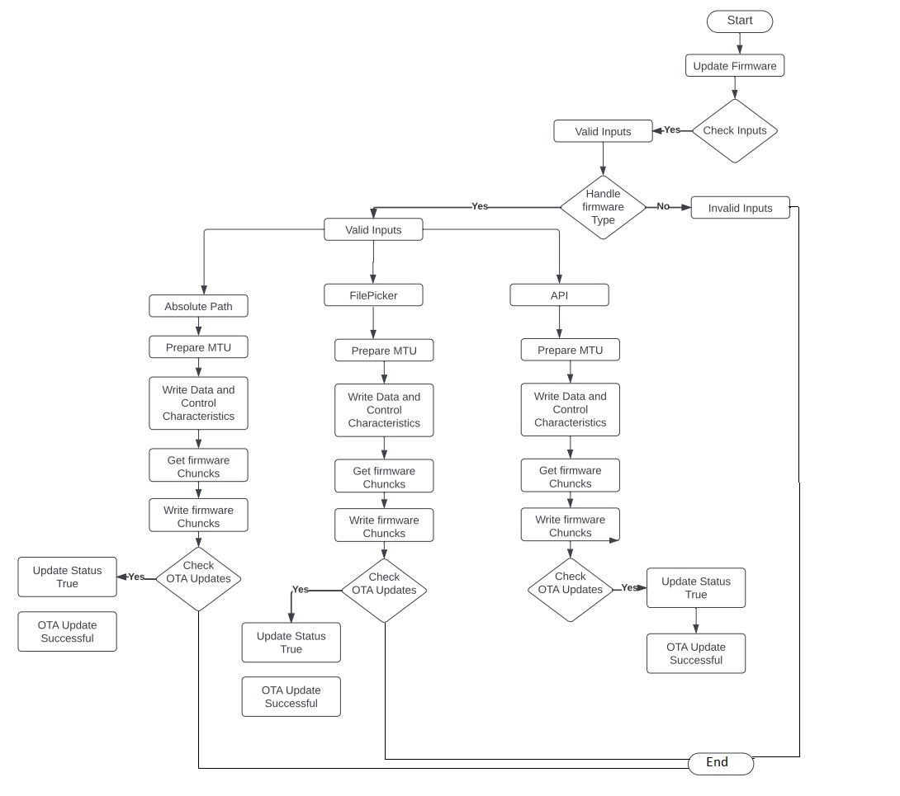

**Package Name:** flutter_ota_package

**Description:**
`flutter_ota_package` is a Dart package that provides functionality to update the firmware of an ESP32 device over Bluetooth Low Energy (BLE). It includes an abstract `OtaPackage` class that defines the necessary methods for performing OTA (Over-The-Air) firmware updates, as well as an implementation specifically designed for ESP32 devices named `Esp32otaPackage`.

**Installation:**
To use this package in your Flutter project, add the following dependency to your `pubspec.yaml` file:

```yaml
dependencies:
  flutter_ota_package: ^1.0.0
```

**Import:**
```dart
import 'package:flutter_ota_package/flutter_ota_package.dart';
```

**OtaPackage:**
This is an abstract class that defines the contract for performing firmware updates over BLE. It has the following methods and properties:

1. `Future<void> updateFirmware(...)`: This method is used to initiate the firmware update process on the target device. It takes the necessary parameters such as the BluetoothDevice instance, firmware type, service and characteristic UUIDs, and optionally the path to the firmware binary file or a URL to fetch the firmware data.

2. `bool Firmwareupdate`: A boolean property that indicates whether the firmware update was successful (`true`) or failed (`false`).

3. `Stream<int> percentageStream`: A stream that emits the progress of the firmware update as an integer percentage value.

**BleRepository:**
This class provides helper methods to interact with the Bluetooth Low Energy (BLE) device. It has the following methods:

1. `Future<void> writeDataCharacteristic(...)`: This method is used to write data to a specific characteristic on the BLE device.

2. `Future<List<int>> readCharacteristic(...)`: This method is used to read data from a specific characteristic on the BLE device.

3. `Future<void> requestMtu(...)`: This method is used to request a specific Maximum Transfer Unit (MTU) size from the BLE device, which can be useful when sending large chunks of firmware data during the update process.


**Constants for FirmwareType:**
To make it easier to represent different firmware types, you can use the following constants:

```dart
const int FIRMWARE_FROM_BINARY_FILE = 1;
const int FIRMWARE_FROM_FILE_PICKER = 2;
const int FIRMWARE_FROM_URL = 3;
```


### How to Use

First, create an instance of `Esp32otaPackage` by passing the required Bluetooth characteristics:

```dart
final esp32otaPackage = Esp32otaPackage(dataCharacteristic, controlCharacteristic);
```

#### Updating Firmware from Binary File

To update the firmware from a binary file, use the `updateFirmware` method with `firmwareType` set to `FIRMWARE_FROM_BINARY_FILE` and provide the file path:

```dart
final String binFilePath = '/path/to/your/firmware.bin';
await esp32OtaPackage.updateFirmware(
  device,
  FIRMWARE_FROM_BINARY_FILE,
  service,
  dataCharacteristic,
  controlCharacteristic,
  binFilePath: binFilePath,
);
```

#### Updating Firmware from File Picker

To update the firmware using a file picker, set `firmwareType` to `FIRMWARE_FROM_FILE_PICKER`, and then call `updateFirmware`:

```dart
await esp32otaPackage.updateFirmware(
  device,
  FIRMWARE_FROM_FILE_PICKER,
  service,
  dataCharacteristic,
  controlCharacteristic,
);
```

A file picker dialog will appear, allowing the user to select the firmware binary file.

#### Updating Firmware from URL

To update the firmware using a URL, set `firmwareType` to `FIRMWARE_FROM_URL` and provide the firmware URL:

```dart
final String firmwareUrl = 'https://your_firmware_url.com/firmware.bin';
await esp32otaPackage.updateFirmware(
  device,
  FIRMWARE_FROM_URL,
  service,
  dataCharacteristic,
  controlCharacteristic,
  url: firmwareUrl,
);
```

### Listening to Progress

You can listen to the firmware update progress using the `percentageStream` provided by `Esp32OtaPackage`. The stream emits progress values (0-100) as the update proceeds:

```dart
final StreamSubscription<int> progressSubscription = esp32otaPackage.percentageStream.listen((progress) {
  print('Firmware update progress: $progress%');
});

// Don't forget to cancel the subscription when it's no longer needed.
// progressSubscription.cancel();
```

## Example App

Here's an example app demonstrating how to use the `flutter_ota_package`:

```dart
import 'package:flutter/material.dart';
import 'package:flutter_

ota_package/flutter_ota_package.dart';

class FirmwareUpdateScreen extends StatefulWidget {
  @override
  _FirmwareUpdateScreenState createState() => _FirmwareUpdateScreenState();
}

class _FirmwareUpdateScreenState extends State<FirmwareUpdateScreen> {
  final BleRepository bleRepo = BleRepository();
  late Esp32otaPackage esp32otaPackage;
  late StreamSubscription<int> progressSubscription;
  bool updatingFirmware = false;

  // Bluetooth device, service, dataCharacteristic, and controlCharacteristic
  // should be initialized here.

  @override
  void initState() {
    super.initState();
    esp32otaPackage = Esp32otaPackage(dataCharacteristic, controlCharacteristic);
  }

  @override
  void dispose() {
    progressSubscription.cancel();
    super.dispose();
  }

  void startFirmwareUpdate() async {
    setState(() {
      updatingFirmware = true;
    });

    try {
      await esp32otaPackage.updateFirmware(
        device,
        FIRMWARE_FROM_BINARY_FILE,
        service,
        dataCharacteristic,
        controlCharacteristic,
        binFilePath: '/path/to/your/firmware.bin',
      );
      if (esp32otaPackage.Firmwareupdate) {
        // Firmware update was successful
        print('Firmware update was successful');
      } else {
        // Firmware update failed
        print('Firmware update failed');
      }
    } catch (e) {
      // Handle errors during the update process
      print('Error during firmware update: $e');
    } finally {
      setState(() {
        updatingFirmware = false;
      });
    }
  }

  @override
  Widget build(BuildContext context) {
    return Scaffold(
      appBar: AppBar(
        title: Text('Firmware Update'),
      ),
      body: Center(
        child: Column(
          mainAxisAlignment: MainAxisAlignment.center,
          children: [
            if (updatingFirmware)
              CircularProgressIndicator()
            else
              ElevatedButton(
                onPressed: startFirmwareUpdate,
                child: Text('Start Firmware Update'),
              ),
          ],
        ),
      ),
    );
  }
}
```

## Flow Chart



## Purpose

The `flutter_ota_package` simplifies the OTA firmware update process for ESP32 devices through Bluetooth Low Energy. It allows developers to wirelessly update the firmware and provides a user-friendly experience. This package lets you easily keep your ESP32 devices up-to-date with the latest firmware.

## Ota firmware

**Main Features of ESP32 OTA Firmware with OTA Package**

1. **Over-the-Air (OTA) Update Capability:** The firmware for ESP32 devices is designed to support Over-the-Air updates via Bluetooth Low Energy (BLE). This allows developers to wirelessly update the firmware of ESP32 devices without the need for physical connections.

2. **NimBLE Bluetooth Stack:** The OTA firmware implementation uses the `NimBLE Bluetooth` stack provided by the ESP-IDF. NimBLE is known for using less flash space and RAM compared to the Bluedroid stack, making it suitable for projects focused on BLE.

3. **Partition Table Setup:** The ESP32's flash storage is divided into multiple partitions, including factory, `ota_0, and ota_1`. When updating the firmware, the new firmware is written to either ota_0 or ota_1 while the factory partition remains unchanged. This allows easy rollback to previous versions if needed.

4. **GATT Services and Characteristics:** The OTA firmware implements two services: Device Information Service (mandatory) and OTA Service. The OTA Service has two characteristics - OTA Control and OTA Data. The OTA Control characteristic is used to initiate and control the OTA update process, while the OTA Data characteristic is used to transfer the firmware from the app to the ESP32.

5. **Asynchronous Programming:** The Flutter package uses asynchronous programming with asyncio to handle BLE communication and notifications efficiently.

6. **OTA Process Sequencing:** The OTA process follows a specific sequence - the app requests OTA, the ESP32 acknowledges the request, the app sends firmware packets to the ESP32, and finally, the ESP32 acknowledges the completion of OTA.

7. **OTA Verification:** After receiving the firmware packets, the ESP32 verifies the integrity of the new firmware before selecting the updated partition for the next boot.

8. **OTA Rollback:** In case of any errors during the OTA update or firmware verification, the ESP32 can roll back to the previous version or the factory partition, ensuring a safe update process.

9. **User-friendly Logging:** The firmware code includes logging statements to provide detailed information about the OTA process, including acknowledgment status and packet transmission status.

10. **Automatic Reboot:** After successfully updating the firmware, the ESP32 automatically reboots to apply the new firmware.

11. **OTA Control Characteristic:**

    a. **Request OTA Update (Write Operation):** When the app wants to initiate an OTA update, it writes a specific value to the OTA Control characteristic. This value serves as a request from the app to start the update process on the ESP32.

    b. **OTA Request Acknowledgment (Notification):** After receiving the OTA update request from the package, the ESP32 acknowledges the request by sending a notification back to the package. This notification indicates that the OTA update process has been acknowledged and is ready to proceed.

    c. **OTA Done Acknowledgment (Notification):** Once the ESP32 has successfully received all the firmware packets from the app and completed the OTA update process, it sends another notification to the package. This notification indicates that the OTA update process has been completed successfully.

    d. **OTA Request Not Acknowledged (Notification):** If, for some reason, the ESP32 cannot proceed with the OTA update, it sends a notification to the package indicating that the OTA request has not been acknowledged. This could happen, for example, if there is an issue with the received firmware or the update process fails the verification.

    e. **OTA Done Not Acknowledged (Notification):** If the ESP32 encounters an error during the verification process after receiving all the firmware packets, it sends a notification to the package indicating that the OTA process has been completed but not acknowledged due to verification failure.

12. **OTA Data Characteristic:**

    a. **Firmware Packets (Write Operation):** The package splits the firmware binary into smaller packets, each of which fits within the MTU (Maximum Transmission Unit) size negotiated during the BLE connection process. It then writes these packets to the OTA Data characteristic on the ESP32. These packets are used to transfer the firmware from the app to the ESP32 for the OTA update.

In summary, the values exchanged between the firmware running on the ESP32 and the app during the OTA update process are:

From App to ESP32:

a. OTA Control Characteristic:

Request OTA Update

From ESP32 to App:

a. OTA Control Characteristic:

- **Request OTA Update (Write Operation):** Value: `1` or `0x01`
- **OTA Request Acknowledgment (Notification):** Value: `2` or `0x02`
- **OTA Done Acknowledgment (Notification):** Value: `3` or `0x03`
- **OTA Request Not Acknowledged (Notification):** Value: `4` or `0x04`
- **OTA Done Not Acknowledged (Notification):** Value: `5` or `0x05`

Both Ways (during firmware transfer):

b. OTA Data Characteristic:

Firmware Packets

By using these specific values, the ESP32 and the app can effectively communicate and coordinate the OTA update process over BLE. This ensures a controlled and reliable update mechanism, allowing the ESP32 to seamlessly receive and apply new firmware wirelessly.